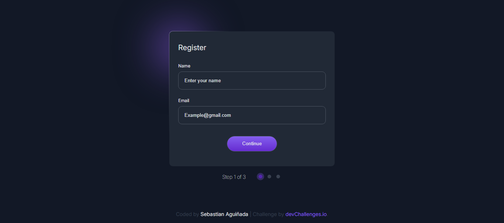

<h1 align="center">multistep register form | devChallenges</h1>

   Solution for a challenge <a href="https://devchallenges.io/challenge/multi-step-register-form" target="_blank">Multi-step Register Form</a> from <a href="http://devchallenges.io" target="_blank">devChallenges.io</a>.

  <h3>
    <a href="https://multi-ui-step-form.netlify.app/">
      Demo
    </a>
     | 
    <a href="https://github.com/Sebascode20/Multi-step-register-form">
      Solution
    </a>
     | 
    <a href="https://devchallenges.io/challenge/multi-step-register-form">
      Challenge
    </a>
  </h3>

<!-- TABLE OF CONTENTS -->

## Table of Contents

- [Overview](#overview)
  - [What I learned](#what-i-learned)
- [Built with](#built-with)
- [Features](#features)
- [Contact](#contact)

<!-- OVERVIEW -->

## Overview

;

### What I learned

This project helped me understand how to work with the JavaScript DOM API and how to use it in conjunction with HTML and CSS to create dynamic websites. As part of my learning process, I’ve set a goal for myself to continuously improve my JavaScript programming skills with each project by applying best practices and ensuring that the website performs at its best.

### Built with

- Semantic HTML5 markup
- CSS3
- CSS custom properties
- Flexbox
- Responsive Design
- SEO

## Features

<!-- List the features of your application or follow the template. Don't share the figma file here :) -->

This application/site was created as a submission to a [DevChallenges](https://devchallenges.io/challenges-dashboard) challenge.

## Author

- GitHub [@Sebascode20](https://github.com/Sebascode20)
